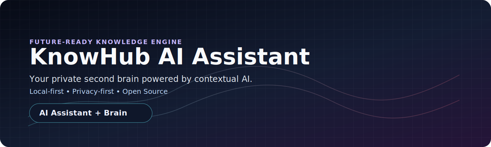
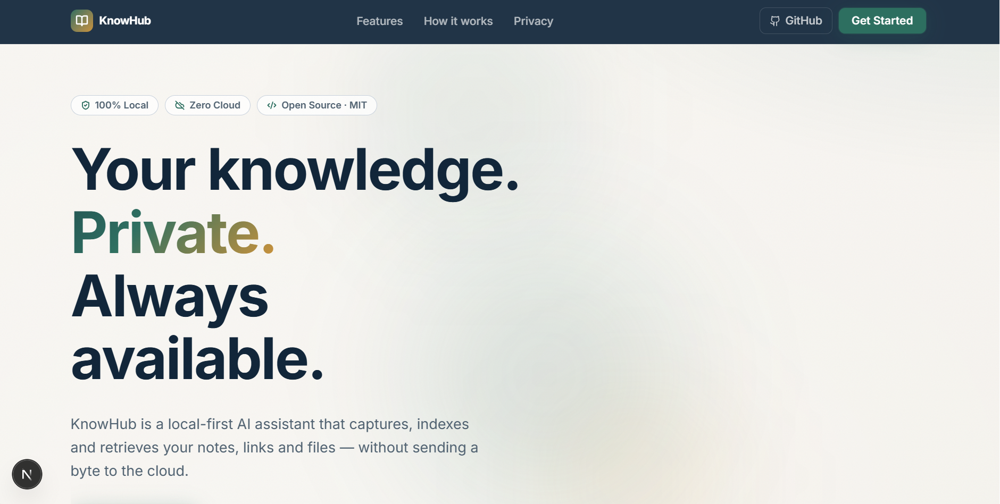
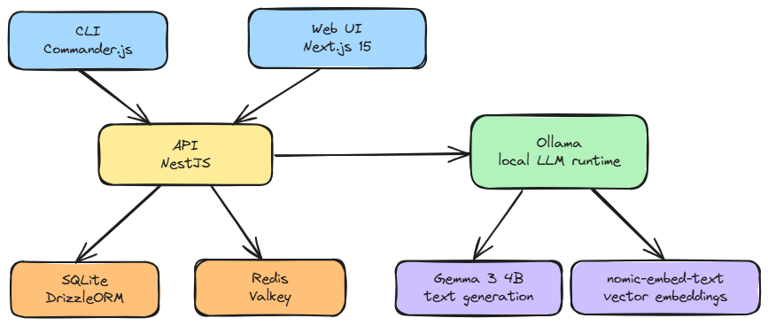

> 🇧🇷 Leia em [Português](README.pt-BR.md)

<div align="center">
  
  <h1>KnowHub AI Assistant</h1>
  <p>Your local-first AI-powered second brain for developers</p>
</div>

<p align="center">
  <a href="https://github.com/glaucia86/knowhub/actions/workflows/ci.yml">
    
  </a>
  <a href="https://opensource.org/licenses/MIT">
    
  </a>
  <a href="https://nodejs.org/">
    
  </a>
  <a href="CONTRIBUTING.md">
    
  </a>
  <a href="https://codecov.io/gh/glaucia86/knowhub">
    
  </a>
  <a href="https://github.com/glaucia86/knowhub/stargazers">
    
  </a>
</p>

---

## What is KnowHub?

KnowHub AI Assistant is a **local-first**, privacy-by-default knowledge manager
powered by AI. It helps developers capture, organize, and retrieve knowledge
from notes, links, PDFs, GitHub issues and more — with semantic search and
AI-generated summaries that never leave your device.

## Development Status

- Current release: `v0.4.2` (`release-v0.4.2`)
- Current phase: **Phase 1 - Core Features** (in progress)
- Delivered in Phase 1:
  - Auth + local setup (CLI onboarding, JWT, secure credential store)
  - Knowledge Entry CRUD API (`NOTE`, `LINK`, `PDF`, `GITHUB`) with tags, lifecycle, reindex, and FTS search support
  - Responsive web landing page
- In progress:
  - End-to-end semantic retrieval + AI Q&A workflows in CLI/Web

|                      🔒 Privacy First                      |                  🧠 Second Brain                   |                     💻 Dev-Focused                     |                 🌍 Open Source                 |
| :--------------------------------------------------------: | :------------------------------------------------: | :----------------------------------------------------: | :--------------------------------------------: |
| All AI runs locally via Ollama — zero cloud, zero tracking | Vector embeddings connect your notes automatically | CLI + REST API + Web UI — pick the interface that fits | MIT licensed, fully hackable, community-driven |

---

## Demo

### Web UI

<div align="center">
  
</div>

### CLI Preview

```bash
# Add a knowledge snippet
$ knowhub add "NestJS guards implement CanActivate and run before route handlers"
✔  Saved · id: kh_7f3a · indexed in 142ms

# Ingest a local file
$ knowhub ingest ./notes/typescript-patterns.md
✔  Ingested 12 entries · 3.2s

# Semantic search
$ knowhub search "async error handling"
→  [0.94] Async/await with try-catch vs .catch() chains
→  [0.89] Promise.allSettled for parallel ops that can fail
→  [0.81] Error boundaries in React for async rendering

# Ask the AI
$ knowhub ask "when should I use Promise.allSettled vs Promise.all?"
🧠  Searching knowledge base...
    Use Promise.allSettled when you need all results regardless of failures.
    Promise.all short-circuits on the first rejection.
    Sources: kh_4a2b, kh_7f3a
```

---

## Architecture

<div align="center">
  
</div>

All components run locally. CLI and Web UI talk to the NestJS API, which stores data in SQLite and delegates AI tasks to Ollama (LLM + embeddings).

---

## Quick Start

### Prerequisites

- [Node.js 20+](https://nodejs.org/)
- [Docker Desktop](https://www.docker.com/products/docker-desktop/) (or Docker Engine + Compose plugin)
- [Git](https://git-scm.com/)

### Installation

```bash
# 1. Clone the repository
git clone https://github.com/glaucia86/knowhub.git
cd knowhub

# 2. Install all workspace dependencies
npm install

# 3. Set up environment variables
npm run env:setup

# 4. Start infrastructure services (Redis + Ollama)
docker compose up -d

# 5. Pull AI models (first time only — ~4 GB download)
make ollama-pull
# or: docker compose exec ollama ollama pull gemma3:4b

# 6. Build core packages
npm run build

# 7. Run one-command local setup (EPIC-1.1)
# published package flow:
# npx knowhub-ai setup
# monorepo local flow:
node apps/cli/dist/index.js setup --reset

# 8. Start development servers
npm run dev
```

Access the app at:

- **Web UI:** http://localhost:3000
- **API:** http://localhost:3001
- **Ollama:** http://localhost:11434

> 💡 **Windows without WSL2:** replace `make ollama-pull` with
> `docker compose exec ollama ollama pull gemma3:4b`
>
> **Windows + OneDrive:** `apps/web` may fail with `spawn EPERM`. Run
> `npm run dev` for the core services and `npm run dev:web` separately.
>
> **Windows + local API auth tests:** if needed, start API with explicit DB:
> `DATABASE_URL=file:C:/Users/<user>/.knowhub/data/knowhub.db`

### Database setup

```bash
npm run db:migrate
npm run db:seed
```

Full reset (removes `apps/api/local.db`, re-runs migrations and seed):

```bash
npm run db:reset
```

Note: the CLI setup command provisions the user-facing local database at
`~/.knowhub/data/knowhub.db`. The `db:*` scripts above are for workspace/dev DB workflows.

---

## Basic Usage

```bash
# Add a knowledge snippet
knowhub add "text or idea to remember"

# Ingest a local file (Markdown, PDF, plain text)
knowhub ingest ./path/to/notes.md

# Semantic search
knowhub search "your query"

# Ask the AI assistant
knowhub ask "your question"

# List recent entries
knowhub list --limit 10
```

> 📖 Full command reference: `knowhub --help`

---

## Tech Stack

| Layer      | Technology                                                              | Purpose                |
| ---------- | ----------------------------------------------------------------------- | ---------------------- |
| API        | [NestJS](https://nestjs.com/)                                           | REST API server        |
| Web        | [Next.js 15](https://nextjs.org/)                                       | Frontend (App Router)  |
| CLI        | [Commander.js](https://github.com/tj/commander.js)                      | Terminal interface     |
| Database   | [SQLite](https://sqlite.org/) + [DrizzleORM](https://orm.drizzle.team/) | Local data storage     |
| Cache      | [Redis/Valkey](https://valkey.io/)                                      | Caching layer          |
| AI         | [Ollama](https://ollama.ai/)                                            | Local LLM runtime      |
| LLM        | [Gemma 3 4B](https://ollama.com/library/gemma3)                         | Language model         |
| Embeddings | [nomic-embed-text](https://ollama.com/library/nomic-embed-text)         | Vector embeddings      |
| Monorepo   | [Turborepo](https://turbo.build/) + npm workspaces                      | Build system           |
| Language   | [TypeScript 5](https://www.typescriptlang.org/)                         | Full-stack type safety |

---

## API Reference

Base URL: `http://localhost:3001/api/v1`

### Knowledge Entries

| Method   | Endpoint                      | Description                                                                    |
| -------- | ----------------------------- | ------------------------------------------------------------------------------ |
| `POST`   | `/knowledge`                  | Create an entry (`NOTE`, `LINK`, `PDF`, `GITHUB`)                              |
| `GET`    | `/knowledge`                  | List entries — paginated, filterable by `type`, `status`, `tag`, full-text `q` |
| `GET`    | `/knowledge/:entryId`         | Retrieve entry detail (chunk count, relation count)                            |
| `PATCH`  | `/knowledge/:entryId`         | Update title, content, source URL, file path, or tags                          |
| `DELETE` | `/knowledge/:entryId`         | Archive an entry (soft delete, recoverable)                                    |
| `POST`   | `/knowledge/:entryId/reindex` | Request reindexing — accepts `INDEXED` / `FAILED` entries                      |

Full Swagger docs: `http://localhost:3001/api`

**Entry lifecycle:** `PENDING` → `INDEXING` → `INDEXED` · soft-archived via `DELETE` → `ARCHIVED` · reindexable via `POST /:id/reindex`

---

## Roadmap

- **Phase 0 — Infrastructure** ✅ Monorepo, CI/CD, local dev environment, open source governance
- **Phase 1 — Core Features** 🚧
  - ✅ Auth & local setup (CLI onboarding, JWT, secure credential store)
  - ✅ Knowledge Entry CRUD (REST API · types: `NOTE` / `LINK` / `PDF` / `GITHUB` · status lifecycle · tags · FTS)
  - ✅ Web landing page (Raycast/Linear design, responsive, animated)
  - 🚧 Semantic retrieval and AI Q&A flows across CLI/Web
- **Phase 2 — Intelligence** 📋 Semantic connections, tagging, summarization
- **Phase 3 — Integrations** 📋 Telegram bot, GitHub issues, PDF ingestion
- **Phase 4 — Polish** 📋 Full Web app, multi-user support, cloud sync (opt-in)

---

## Contributing

Contributions are welcome! 🎉

```bash
git clone https://github.com/glaucia86/knowhub.git && cd knowhub && npm install
```

See [CONTRIBUTING.md](CONTRIBUTING.md) for commit conventions and PR guidelines.
Good first task? Check [good first issues](https://github.com/glaucia86/knowhub/labels/good%20first%20issue).

> By contributing you agree to our [Code of Conduct](CODE_OF_CONDUCT.md).
> Found a security issue? Read [SECURITY.md](SECURITY.md) before reporting.

---

## License

Distributed under the MIT License. See [LICENSE](LICENSE) for more information.

---

## About the Author

<div align="center">
  
  <br/><br/>
  <strong>Glaucia Lemos</strong>
  <br/>
  <sub>A.I Developer Specialist &nbsp;·&nbsp; Microsoft MVP — Web Technologies</sub>
  <br/><br/>
  <a href="https://github.com/glaucia86">
    
  </a>
  &nbsp;
  <a href="https://www.linkedin.com/in/glaucialemos/">
    
  </a>
  &nbsp;
  <a href="https://x.com/glaucia_lemos86">
    
  </a>
  &nbsp;
  <a href="https://mvp.microsoft.com/pt-BR/MVP/profile/d3200941-395d-423b-a0ec-eb0577d3bb86">
    
  </a>
</div>
